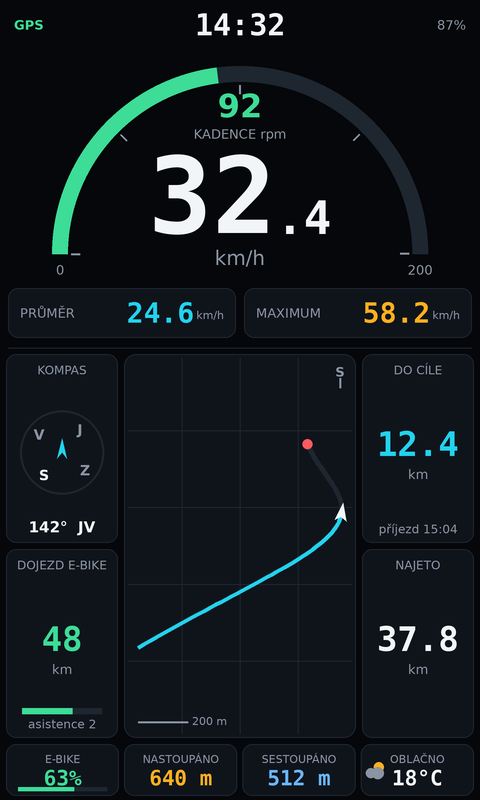

# Garmin Connect IQ

Dvě aplikace a společné vývojové prostředí:

- **[RideDashboard](#ridedashboard--palubovka-pro-edge-1050)** — palubovka pro
  cyklopočítač Edge 1050 (480×800): tachometr s půlkruhem kadence, mapa přístroje
  uprostřed, metriky kolem ní a spodní lišta se stavem baterie, převýšením
  a počasím.
- **[QMailDashboard](#qmaildashboard--stav-schránky-na-hodinkách)** — stav
  poštovní schránky jako hustota pravděpodobnosti `|ψ|²` podle knihovny `qmail`.

---

# RideDashboard — palubovka pro Edge 1050



Rozvržení shora dolů:

| Pásmo | Obsah |
|---|---|
| Horní lišta | hodiny, stav GPS, baterie jednotky |
| Půlkruh 0–200 | kadence; barva se mění podle pásma (pod 50 šedá, do 100 zelená, do 150 oranžová, výš červená) |
| Střed půlkruhu | digitální tachometr, desetinné místo menším písmem |
| Pod rychlostí | průměrná a maximální rychlost |
| Prostřední pás | mapa uprostřed, po stranách kompas a dojezd na elektřinu (vlevo), vzdálenost do cíle a najeté kilometry (vpravo) |
| Spodní lišta | zbývající energie e-biku, nastoupáno, sestoupáno, teplota a počasí |

## Mapa uprostřed palubovky

Uprostřed je **opravdová mapa z paměti přístroje**, ne jen nakreslená stopa:


Trik je v tom, že `setScreenVisibleArea()` mapu neořízne. Mapa se vykreslí pod
celou obrazovkou a metoda jen říká, na kterou část se má zaostřit a co ještě
není zakryté rozhraním aplikace — přesně jak to popisuje vlákno
[MapView](https://forums.garmin.com/developer/connect-iq/f/discussion/7014/mapview)
na fóru Connect IQ. Okolí mapového okna si tedy aplikace musí přebarvit sama,
jinak kartografie prosvítá pod ciferníky.

Prakticky to znamená:

- `RideMapView` dědí z `MapTrackView`, takže se mapa sama drží aktuální polohy
  a kreslí navigační šipku; projetá stopa jde nad ni jako `MapPolyline`.
- `RideChrome` v mapovém režimu nemaže celé plátno (`dc.clear()` by mapu
  přetřel), ale vyplní jen čtyři pruhy kolem okna.
- Mapové view nejde vrátit z `getInitialView()`, dá se jen vystrčit přes
  `pushView()`. Výchozí obrazovka je proto `RideView` a mapa se otevře hned po
  startu.
- **Výběr** přepne mapu přes celou obrazovku (`MAP_MODE_BROWSE`, posouvání
  a zoom jako v nativní mapě), **zpět** vrátí palubovku a podruhé odejde na
  variantu s drobečkovou stopou.
- Bez map v paměti (`WatchUi has :MapTrackView`) nebo po vypnutí volby *Mapa
  z paměti přístroje* zůstane drobečková stopa z GPS bodů. Pozor při přidávání
  jednotek bez kartografie do manifestu — třída dědící z `MapTrackView` se pro
  ně nepřeloží, musela by se vyřadit anotací v `monkey.jungle`.

Co Connect IQ neumožňuje: **baterii e-biku**. ANT+ profil elektrokol (LEV)
v API není, takže dojezd je **odhad** — uživatel v nastavení zadá dojezd na
plnou baterii a aplikace ho úměrně krátí podle ujeté vzdálenosti.

Rozvržení je popsané v `RideDashboard/resources/json/layout.json` v pixelech
návrhového plátna 480×800; při kreslení se přepočítá na skutečný displej, takže
stejná čísla platí i pro menší jednotky Edge.

```bash
python3 garmin/tools/preview_ride.py            # náhled s drobečkovou stopou
python3 garmin/tools/preview_ride.py --map \
    --out garmin/docs/preview/ride-edge1050-map.png   # náhled s mapou
./garmin/check.sh RideDashboard                 # překlad bez Garmin účtu
./garmin/run_simulator.sh edge1050 RideDashboard
```

V náhledu s `--map` je kartografie jen ilustrace toho, co na přístroji vykreslí
`MapTrackView` — renderer žádné mapové podklady nemá.

---

# QMailDashboard — stav schránky na hodinkách

Hodinková aplikace, která ukazuje stav schránky tak, jak ho počítá `qmail`:
ne jako „máš 3 spamy“, ale jako **hustotu pravděpodobnosti `|ψ|²`** přes
verdikty *legitimní / spam / phishing*. Obvod displeje je celý pravděpodobnostní
prostor, střed je kolaps měřením a proužek dole je neurčitost (entropie), tedy
kolik pošty si zaslouží ruční pohled.


Zleva: čistá schránka, převaha spamu, jasný phishing a stav, kdy je vlnová
funkce rozprostřená skoro rovnoměrně — právě tehdy má smysl kontrolovat ručně.

## Co je v aplikaci

| Prvek | Význam |
|---|---|
| Barevný prstenec | `\|ψ\|²` jednotlivých verdiktů; délka oblouku = pravděpodobnost |
| Text ve středu | kolaps (`argmax \|ψ\|²`) a jeho jistota |
| Modrý proužek | normalizovaná entropie — jak je stav „rozmazaný“ |
| Patička | kolik e-mailů čeká na ruční kontrolu z celkového počtu měření |
| Glance | tentýž stav na jeden řádek v seznamu aplikací |


Rozvržení se počítá z rozměrů displeje, takže sedí na kulaté i hranaté panely:


## Struktura

```
garmin/
  QMailDashboard/
    manifest.xml                     # seznam zařízení, oprávnění, minApiLevel
    monkey.jungle                    # build konfigurace
    resources/json/theme.json        # barvy a geometrie – jediný zdroj pravdy
    resources/settings/              # adresa endpointu, interval obnovy
    source/QMailApp.mc               # vstupní bod aplikace + glance
    source/QMailModel.mc             # data: web request nebo demo hodnoty
    source/DashboardView.mc          # kreslení prstence a středu
    source/GlanceView.mc             # kompaktní řádek
  RideDashboard/
    resources/json/layout.json       # rozvržení palubovky v pixelech 480x800
    resources/settings/              # dojezd na plnou baterii, počasí, mapa
    source/RideApp.mc                # vstupní bod + odběr GPS pozic
    source/RideLayout.mc             # škálování návrhu na displej, výběr fontů
    source/RideData.mc               # metriky z Activity, Weather a Position
    source/RideChrome.mc             # kreslení palubovky (sdílí obě obrazovky)
    source/RideView.mc               # varianta s drobečkovou stopou
    source/RideMapView.mc            # varianta s mapou z paměti přístroje
  tools/preview.py                   # náhled qmail dashboardu do PNG
  tools/preview_ride.py              # náhled palubovky do PNG
  tools/qmail_server.py              # servíruje reálná data z .eml složky
  tools/make_icon.py                 # launcher ikona z barev tématu
  tools/sync_devices.py              # srovná manifest se staženými zařízeními
  tools/stub_device.py               # náhradní definice zařízení pro překlad
  setup_dev_env.sh                   # instalace SDK, závislostí a klíče
  check.sh                           # překlad bez Garmin účtu (syntaxe a typy)
  build.sh / run_simulator.sh        # překlad a spuštění v simulátoru
```

Konfigurační JSON (`theme.json`, `layout.json`) čte jak hodinková aplikace
(`Rez.JsonData`), tak náhledový renderer — barvy i rozvržení se tak mění na
jednom místě.

## Instalace prostředí

```bash
./garmin/setup_dev_env.sh          # SDK, běhové závislosti simulátoru, klíč
source ~/connectiq/env.sh          # monkeyc, monkeydo, simulator v PATH
```

Skript stáhne Connect IQ SDK pro Linux, doplní knihovny, které simulátor
potřebuje (je slinkovaný proti `webkit2gtk-4.0`, který v Ubuntu 24.04 chybí),
vygeneruje podepisovací klíč a nainstaluje headless
[connect-iq-sdk-manager](https://github.com/lindell/connect-iq-sdk-manager-cli).

### Device packy vyžadují Garmin účet

Definice zařízení a fonty pro simulátor Garmin nepublikuje volně — endpoint
`api.gcs.garmin.com/ciq-product-onboarding/devices` vrací bez přihlášení `401`
a GUI SDK Manager taky začíná loginem. Bez nich `monkeyc -d <zařízení>` skončí
na `Invalid device id` a simulátor nemá co zobrazit.

```bash
export GARMIN_USERNAME="..."       # účet z developer.garmin.com
export GARMIN_PASSWORD="..."
connect-iq-sdk-manager agreement accept
connect-iq-sdk-manager login
connect-iq-sdk-manager device download --manifest garmin/QMailDashboard/manifest.xml --include-fonts
python3 garmin/tools/sync_devices.py    # srovná manifest se staženým
```

## Kontrola překladu bez Garmin účtu

`monkeyc` vyžaduje cílové zařízení, ale ke kontrole syntaxe a typů stačí
vlastnoručně napsaný `compiler.json` — žádný stažený device pack:

```bash
./garmin/check.sh                     # oba projekty
./garmin/check.sh RideDashboard       # jen jeden
./garmin/check.sh RideDashboard -l 2  # ukecanější typová analýza
```

Skript si vyrobí náhradní zařízení (`qmailstub` 454×454 kulaté, `ridestub`
480×800 hranaté) a přeloží proti němu dočasnou kopii projektu. Na spuštění
v simulátoru to nestačí — ten navíc potřebuje Garmin fonty — ale odhalí to
všechno, co odmítne překladač.

## Překlad a spuštění

```bash
./garmin/build.sh fenix847mm                       # -> QMailDashboard/bin/*.prg
./garmin/build.sh edge1050 RideDashboard
./garmin/run_simulator.sh edge1050 RideDashboard   # překlad + simulátor
```

Na stroji bez obrazovky si nejdřív pusť X server:

```bash
Xvfb :1 -screen 0 1280x1024x24 & export DISPLAY=:1
```

## Náhled bez simulátoru

Dokud device packy nejsou k dispozici, vykreslí stejnou obrazovku renderer
v Pythonu. Používá `theme.json` a opakuje postup z `DashboardView.mc`, takže
změna barev nebo rozvržení je vidět hned:

```bash
python3 garmin/tools/preview.py --all                       # vše do garmin/docs/preview
python3 garmin/tools/preview.py --device venu3 --scenario spam
python3 garmin/tools/preview.py --json http://localhost:8720/qmail.json
```

Je to náhled, ne snímek ze simulátoru — písma jsou nahrazená DejaVu, takže
metriky textu se od Garmin fontů o pár pixelů liší.

## Reálná data z qmailu

Aplikace umí číst JSON z adresy vyplněné v nastavení (Connect IQ Mobile nebo
pole *Settings* v simulátoru). Endpoint dodá `tools/qmail_server.py`, který
prožene složku s `.eml` knihovnou `qmail` a složí z výsledků jedno rozdělení
pro celou schránku:

```bash
python3 garmin/tools/qmail_server.py --mail-dir examples --port 8720
python3 garmin/tools/qmail_server.py --once      # jen vypsat JSON
```

```json
{
  "verdict": "phishing",
  "probabilities": { "ham": 0.011, "spam": 0.027, "phishing": 0.963 },
  "confidence": 0.963,
  "uncertainty": 0.165,
  "needs_review": 3,
  "scanned": 128
}
```

Bez vyplněné adresy aplikace ukazuje demo hodnoty odpovídající rozboru
`examples/phishing.eml` a v titulku má `qmail · demo`.
