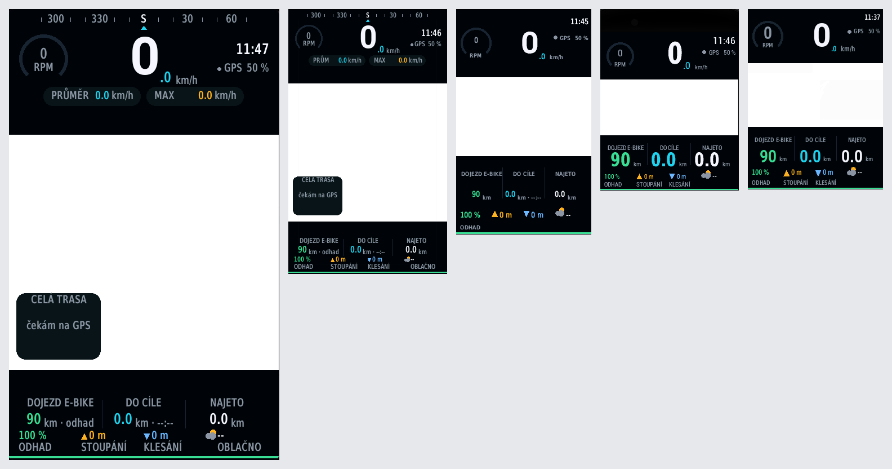

# Garmin Connect IQ

Dvě aplikace a společné vývojové prostředí:

- **[RideDashboard](#ridedashboard--palubovka-pro-edge)** — palubovka pro
  cyklopočítače Edge ve stylu přístrojového štítu auta: mapa přístroje pod celou
  obrazovkou, nad ní tachometr, kadence, dojezd e-biku, převýšení a počasí.
  Přeložená pro celou řadu od Edge 830 výš.
- **[QMailDashboard](#qmaildashboard--stav-schránky-na-hodinkách)** — stav
  poštovní schránky jako hustota pravděpodobnosti `|ψ|²` podle knihovny `qmail`.

---

# RideDashboard — palubovka pro Edge

Dva styly, přepínají se v nastavení aplikace.

## Styl „přístrojový štít“ (výchozí)


Mapa vyplňuje celou obrazovku a přes ni jsou dva překryvy jako v přístrojovém
štítu auta — nahoře kompasová páska, tříčtvrteční budík kadence, digitální
tachometr s desetinným místem v akcentu, hodiny a pilulky s průměrnou
a maximální rychlostí; dole dojezd e-biku, vzdálenost do cíle s odhadem
příjezdu, najeté kilometry a řádek se stavem baterie, převýšením a počasím.
V rohu mapy je náhled celé projeté trasy, aby byl vidět tvar jízdy i při
zazoomované mapě, a spodní hranu displeje lemuje tenký proužek baterie.

Překryvy nemají tvrdou hranu: směrem k mapě se rozplývají do ztracena. Kreslí
se jako plná výplň a pár desítek pruhů s klesající alfou přes
`Graphics.createColor()` (API 4.0 a výš). Na starších jednotkách zůstane
neprůhledný pruh, jinak se nezmění nic.

## Styl „panely“


Rozvržení shora dolů:

| Pásmo | Obsah |
|---|---|
| Horní lišta | hodiny, stav GPS, baterie jednotky |
| Půlkruh 0–200 | kadence; barva se mění podle pásma (pod 50 šedá, do 100 zelená, do 150 oranžová, výš červená) |
| Střed půlkruhu | digitální tachometr, desetinné místo menším písmem |
| Pod rychlostí | průměrná a maximální rychlost |
| Prostřední pás | mapa uprostřed, po stranách kompas a dojezd na elektřinu (vlevo), vzdálenost do cíle a najeté kilometry (vpravo) |
| Spodní lišta | zbývající energie e-biku, nastoupáno, sestoupáno, teplota a počasí |

## Jak se mapa dostane do vlastního rozvržení

V obou stylech je to **opravdová mapa z paměti přístroje**, ne jen nakreslená
stopa. Trik je v tom, že `setScreenVisibleArea()` mapu neořízne. Mapa se vykreslí pod
celou obrazovkou a metoda jen říká, na kterou část se má zaostřit a co ještě
není zakryté rozhraním aplikace — přesně jak to popisuje vlákno
[MapView](https://forums.garmin.com/developer/connect-iq/f/discussion/7014/mapview)
na fóru Connect IQ. Okolí mapového okna si tedy aplikace musí přebarvit sama,
jinak kartografie prosvítá pod ciferníky.

Prakticky to znamená:

- `RideMapView` dědí z `MapTrackView`, takže se mapa sama drží aktuální polohy
  a kreslí navigační šipku; projetá stopa jde nad ni jako `MapPolyline`.
- Kreslení nesmí v mapovém režimu zavolat `dc.clear()`, ten by mapu přetřel.
  `RideChrome` proto vyplní jen čtyři pruhy kolem okna a `RideCockpit` jen dva
  překryvy nahoře a dole.
- Mapové view nejde vrátit z `getInitialView()`, dá se jen vystrčit přes
  `pushView()`. Výchozí obrazovka je proto `RideView` a mapa se otevře hned po
  startu.
- **Výběr** přepne mapu přes celou obrazovku (`MAP_MODE_BROWSE`, posouvání
  a zoom jako v nativní mapě), **zpět** vrátí palubovku a podruhé odejde na
  variantu s drobečkovou stopou.
- Bez map v paměti (`WatchUi has :MapTrackView`) nebo po vypnutí volby *Mapa
  z paměti přístroje* zůstane drobečková stopa z GPS bodů. Pozor při přidávání
  jednotek bez kartografie do manifestu — třída dědící z `MapTrackView` se pro
  ně nepřeloží, musela by se vyřadit anotací v `monkey.jungle`.

## Dojezd elektrokola: měření místo odhadu

Edge dojezd e-biku ukazuje sám, ale Connect IQ na něj hotovou třídu nemá —
`Toybox.AntPlus` zná pulsy, výkon i řazení, profil elektrokol (LEV) v něm
chybí. Dá se ale obejít: `RideLev` si otevře **generický ANT kanál** na device
type 20 (frekvence 57, perioda 8192 = 4 Hz) a datové stránky si rozebere sám.

| Stránka | Co z ní bereme |
|---|---|
| 1 | stupeň asistence, rychlost kola |
| 2 | **dojezd v km** (12 bitů, nula = kolo neví), odometr |
| 3 | stav baterie v procentech, varování o vybití, % asistence |
| 4 | spotřeba ve Wh/km, kilometry od posledního nabití |
| 34 | náhrada stránky 2 — místo dojezdu posílá spotřebu |

Kanál je jen poslouchající (`CHANNEL_TYPE_RX_ONLY`) — Giant RideControl jiný typ
kanálu nepřijme a zároveň tím kolu nic neposíláme.

Dojezd, baterie i spotřeba fungují na **jakémkoli kole s profilem LEV** — to je
standard, ne značková věc. Značkové jsou jen názvy režimů asistence: profil
posílá pouhé číslo stupně 0–7 a Garmin ho proto nativně ukazuje jen jako číslo
nebo sloupečky. Ze společné stránky 80 se ale dá přečíst **výrobce** (číselník
je stejný jako ve FIT), takže stupeň jde pojmenovat tak, jak svítí na kole:

| Výrobce (ID) | Režimy | Poznámka |
|---|---|---|
| Giant (108) | ECO, BASIC, ACTIVE, AUTO, SPORT, POWER | ověřené rozprostření po stupních 0–7 |
| Specialized (63), Mahle (299) | ECO, TRAIL, TURBO | ověřené |
| Yamaha (304) | ECO+, ECO, STD, HIGH, EXPW | ověřené |
| Fazua (318) | BREEZE, RIVER, ROCKET | jen když kolo hlásí tři stupně |
| TQ (141) | ECO, MID, HIGH | jen když kolo hlásí tři stupně |

U prvních tří značek je ověřené i to, jak se jejich režimy rozprostřou po sedmi
stupních profilu (kola s méně režimy stupně zdvojují). U Fazuy a TQ známe jen
pořadí režimů, takže je aplikace pojmenuje jen tehdy, když kolo na stránce 5
hlásí přesně tolik stupňů, kolik jich značka má — pak je mapování jedna ku jedné
a není co odhadovat. Jinak zůstane `ASIST 3/5`, tedy stupeň a počet režimů z kola.
Vymyslet si jméno je horší než ho neukázat.

Po prvním spárování se ANT+ ID kola uloží do nastavení, aby se kanál příště
nechytil cizího kola, které jede kolem. Vynulováním pole se aplikace spáruje
znovu.

Dojezd se bere v tomto pořadí:

1. **přímo z kola** (stránka 2) — totéž číslo, co ukazuje Edge, kolo v něm má
   vlastní spotřebu i nastavenou asistenci,
2. **ze stavu baterie** — když kolo dojezd neposílá, spočítá se z procent
   a spotřeby ve Wh/km podle kapacity vyplněné v nastavení; bez kapacity
   z poměrné části dojezdu na plnou,
3. **z baterie přes Bluetooth** — pro kola bez ANT+ LEV, viz níže,
4. **odhad z ujetých kilometrů** — když se s kolem nemluví vůbec.

Odhad se v palubovce přizná: v přístrojovém štítu jednotkou `km · odhad`
a popiskem `E-BIKE · ODHAD`, v panelech poznámkou pod hodnotou. Měřený dojezd
naopak ukazuje i režim asistence (`E-BIKE · ACTIVE`).


Profil LEV vysílá Giant (RideControl), Specialized, Yamaha, Mahle, Fazua Ride 60
(od firmware bundle 007) a TQ HPR50 v Treku Fuel EXe. Ne každý systém posílá
všechno — TQ třeba dojezd nehlásí, takže se počítá ze stavu baterie.

### Bluetooth jako záloha

Edge 1050 (a stejně tak 1040, 840, 540 nebo Explore 2) umí v Connect IQ
i `Toybox.BluetoothLowEnergy` v roli centrály, takže pro kola bez ANT+ LEV je
tu druhá cesta. Má ale úzké hrdlo: **přečíst jde jen to, co je standardní.**
`RideBle` proto hledá službu **Battery Service (0x180F)** a z ní
charakteristiku **Battery Level (0x2A19)**, tedy procenta baterie. Kolo se
najde podle jména vyplněného v nastavení (prázdné pole = nehledat, skenování
stojí baterii), aplikace se s ním spáruje, jednou za půl minuty si o hodnotu
řekne a přihlásí se i k oznámením. Procenta pak vejdou do stejného řetězce jako
data z ANT+ a dojezd se z nich dopočítá; v palubovce je to poznat popiskem
`E-BIKE · BLE`.

Co přes Bluetooth **nejde**:

- **DJI Avinox** (Amflow a spol.) telemetrii nevysílá vůbec — jeho ANT+
  certifikace je jen na *příjem* dat z hrudního pásu do displeje kola, a BLE
  má vyhrazené pro vlastní aplikaci. Proto pro něj v tabulce výše není řádek:
  nejde ani přečíst, ani rozpoznat.
- **Bosch Smart System** má sice od května 2026 veřejně zdokumentované Live
  Data Interface (protobuf, Apache-2.0), jenže vyžaduje šifrované spojení
  a aktivační sekvenci, na kterou Connect IQ nemá dosah. Novější firmware Edge
  ale Bosch podporuje nativně přes systémové menu *Senzory* — tam se s ním
  aplikace prát nemá.
- **Shimano STEPS** vozí data ve vlastních službách (`…5348494D414E4F…`, tedy
  „SHIMANO“ v ASCII), které specifikované nejsou.

**Pozor na nativní spárování:** na jednom kole může viset jen jeden posluchač.
Když je e-bike připojený přes systémové menu *Senzory* nebo ho drží jiná
Connect IQ aplikace, náš kanál data nedostane a dojezd spadne na odhad — kolo
je pak potřeba ze *Senzorů* odpojit. Data se objeví do zhruba patnácti vteřin
od chvíle, kdy je Edge blízko ovladače kola.

## Nastavení

Všechno jde nastavit dvěma cestami. Z telefonu přes Garmin Connect (styl
palubovky, mapa, počasí, elektrokolo, kapacita baterie, jméno kola v Bluetooth)
a **tlačítkem menu přímo v přístroji**, kde je zkrácený výběr: styl, mapa,
elektrokolo, nové spárování kola, kapacita baterie a dojezd na plnou. Obojí
píše do stejných properties.

Menu v přístroji tam není pro parádu: aplikace nahraná ručně (sideload) se
v Garmin Connect ani v Garmin Expressu neobjeví, takže při testování je to
jediná cesta, jak se k nastavení dostat.

## Které jednotky palubovka umí

Celá řada Edge od **830** výš. Starší modely (Explore, 820, 520, 130) mají API
3.1 a míň, kde chybí i mapové view, takže v manifestu nejsou.

| Přístroj | Displej | API | Rozvržení |
|---|---|---|---|
| Edge 1050 | 480×800 | 6.0 | plné |
| Edge 850, 550 | 420×600 | 6.0 | plné |
| Edge 1040 / Solar | 282×470 | 6.0 | plné |
| Edge 1030 Plus, 1030, 1030 Bontrager | 282×470 | 3.3 | plné |
| Edge 840 / Solar, 540 / Solar | 246×322 | 6.0 | kompaktní |
| Edge 830, 530 | 246×322 | 3.3 | kompaktní |
| Edge Explore 2 | 240×400 | 5.1 | kompaktní |
| Edge MTB | 240×320 | 6.0 | kompaktní |



Zleva Edge 1050, 1040, Explore 2, 830 a MTB — všechny snímky ze simulátoru
v měřítku 1:1, takže jsou vidět skutečné poměry.

### Dvě rozvržení, protože font má dno

Rozvržení je popsané v `resources/json/layout.json` v pixelech návrhového
plátna a při kreslení se přepočítá na skutečný displej. Jedno plátno na
všechno ale nestačí: **nejmenší systémový font Garminu se zmenšit nedá.**
Na Edge 1050 je `FONT_XTINY` vysoký 21 pixelů, na Edge 830 třináct — poměrově
k displeji je tedy na malé jednotce skoro dvakrát větší. Popisky, které se na
1050 pohodlně vejdou do čtvrtiny šířky, na 830 přetečou do sousedního sloupce.

Proto jsou plátna dvě a `monkey.jungle` je přiřazuje podle zařízení:

- `resources/json/layout.json` — plátno 480×800 pro jednotky od 282 pixelů šířky,
- `resources-compact/json/layout.json` — plátno 246×322 pro úzké displeje.
  Vynechává, co se na ně čitelně nevejde: kompasovou pásku, pilulky s průměrem
  a maximem a přehledovou stopu v rohu mapy (klíč `features`).

Rozhoduje šířka, ne úhlopříčka. Edge Explore 2 je svisle vysoký, ale 240 pixelů
na šířku ho staví vedle Edge 830, ne vedle 1050.

Zbytek si kreslení dopočítá samo: řádky se skládají podle **změřených šířek
a výšek písma**, ne podle pevných souřadnic. Když se popiska nevejde ani
nejmenším fontem, sáhne se po kratší variantě (`E-BIKE · ODHAD` → `ODHAD`,
`NASTOUPÁNO` → `STOUPÁNÍ`, `km · odhad` → `km`) a v krajním případě se vynechá —
u šipek převýšení směr stejně říká sama šipka.

## Nahrání do přístroje

Hotové buildy pro všechny jednotky jsou ve `dist/RideDashboard/`, i s přehledem
v `PREHLED.txt`. Do přístroje se dostanou ručně:

1. připoj Edge USB kabelem, přihlásí se jako MTP zařízení,
2. zkopíruj `.prg` **pro svůj model** do složky `GARMIN/APPS`,
3. odpoj přístroj — aplikace se objeví mezi Connect IQ aplikacemi.

Po odpojení soubor ze složky zmizí, to je v pořádku: firmware si ho přesune do
vlastního úložiště. Nahrávej vždy build přeložený pro **to zařízení, na kterém
se bude spouštět** — Edge cizí build tiše zahodí a napíše to jen do
`GARMIN/APPS/LOGS`.

Přeložit znovu (potřebuje Garmin developer účet kvůli device packům):

```bash
export GARMIN_USERNAME="..."       # účet z developer.garmin.com
export GARMIN_PASSWORD="..."
./garmin/setup_dev_env.sh          # SDK, device packy pro zařízení z manifestu
./garmin/build_all.sh              # všechny jednotky naráz do garmin/dist
./garmin/build.sh edge1050 RideDashboard   # nebo jen jednu
```

Buildy v `dist` jsou podepsané klíčem z `~/connectiq/keys`, který si
`setup_dev_env.sh` vygeneruje. Pro ruční nahrání to stačí; do Connect IQ Store
by bylo potřeba mít vlastní stálý klíč a ten samý používat i pro aktualizace.

## Ladění rozvržení

```bash
python3 garmin/tools/preview_ride.py --cockpit --map    # přístrojový štít
python3 garmin/tools/preview_ride.py --map              # panely s mapou
python3 garmin/tools/preview_ride.py                    # panely bez mapy
python3 garmin/tools/preview_ride.py --cockpit --map --estimate  # kolo bez LEV
./garmin/check.sh RideDashboard                         # překlad bez Garmin účtu
./garmin/run_simulator.sh edge1050 RideDashboard
```

V náhledu s `--map` je kartografie jen ilustrace toho, co na přístroji vykreslí
`MapTrackView` — renderer žádné mapové podklady nemá.

Náhled v Pythonu kreslí písmem DejaVu, takže **na překryvy se spolehnout nedá** —
to se pozná až se skutečnými Garmin fonty. Na to je simulátor:

```bash
export DISPLAY=:1                                  # na headless stroji Xvfb
garmin/tools/sim_shot.sh edge830 RideDashboard /tmp/edge830.png
garmin/tools/sim_sweep.sh                          # všechny jednotky z manifestu
python3 garmin/tools/crop_screen.py edge830 /tmp/edge830.png docs/device/edge830.png
```

`sim_sweep.sh` projde manifest, každou jednotku spustí a uloží snímek do
`/tmp/sim-sweep`; `crop_screen.py` z okna simulátoru vyřízne samotný displej.

---

# QMailDashboard — stav schránky na hodinkách

Hodinková aplikace, která ukazuje stav schránky tak, jak ho počítá `qmail`:
ne jako „máš 3 spamy“, ale jako **hustotu pravděpodobnosti `|ψ|²`** přes
verdikty *legitimní / spam / phishing*. Obvod displeje je celý pravděpodobnostní
prostor, střed je kolaps měřením a proužek dole je neurčitost (entropie), tedy
kolik pošty si zaslouží ruční pohled.


Zleva: čistá schránka, převaha spamu, jasný phishing a stav, kdy je vlnová
funkce rozprostřená skoro rovnoměrně — právě tehdy má smysl kontrolovat ručně.

## Co je v aplikaci

| Prvek | Význam |
|---|---|
| Barevný prstenec | `\|ψ\|²` jednotlivých verdiktů; délka oblouku = pravděpodobnost |
| Text ve středu | kolaps (`argmax \|ψ\|²`) a jeho jistota |
| Modrý proužek | normalizovaná entropie — jak je stav „rozmazaný“ |
| Patička | kolik e-mailů čeká na ruční kontrolu z celkového počtu měření |
| Glance | tentýž stav na jeden řádek v seznamu aplikací |


Rozvržení se počítá z rozměrů displeje, takže sedí na kulaté i hranaté panely:


## Struktura

```
garmin/
  QMailDashboard/
    manifest.xml                     # seznam zařízení, oprávnění, minApiLevel
    monkey.jungle                    # build konfigurace
    resources/json/theme.json        # barvy a geometrie – jediný zdroj pravdy
    resources/settings/              # adresa endpointu, interval obnovy
    source/QMailApp.mc               # vstupní bod aplikace + glance
    source/QMailModel.mc             # data: web request nebo demo hodnoty
    source/DashboardView.mc          # kreslení prstence a středu
    source/GlanceView.mc             # kompaktní řádek
  RideDashboard/
    manifest.xml                     # řada Edge od 830 výš, oprávnění
    monkey.jungle                    # přiřazení rozvržení a ikon k zařízením
    resources/json/layout.json       # rozvržení palubovky v pixelech 480x800
    resources-compact/json/          # totéž na plátně 246x322 pro úzké displeje
    resources-icon{35,36,40,56,68}/  # launcher ikona ve velikostech, co Edge chtějí
    resources/settings/              # elektrokolo, dojezd, počasí, mapa, styl
    source/RideApp.mc                # vstupní bod + odběr GPS pozic
    source/RideLayout.mc             # škálování návrhu na displej, výběr fontů
    source/RideData.mc               # metriky z Activity, Weather a Position
    source/RideLev.mc                # elektrokolo přes ANT+ profil LEV
    source/RideBle.mc                # baterie kola přes standardní BLE službu
    source/RideMenu.mc               # nastavení přímo v přístroji
    source/RideChrome.mc             # kreslení stylu s panely
    source/RideCockpit.mc            # kreslení stylu přístrojového štítu
    source/RideView.mc               # obrazovka s drobečkovou stopou
    source/RideMapView.mc            # obrazovka s mapou z paměti přístroje
  dist/RideDashboard/                # hotové .prg k nahrání + PREHLED.txt
  docs/device/                       # snímky ze simulátoru 1:1
  tools/preview.py                   # náhled qmail dashboardu do PNG
  tools/preview_ride.py              # náhled palubovky do PNG
  tools/qmail_server.py              # servíruje reálná data z .eml složky
  tools/make_icon.py                 # launcher ikona qmailu z barev tématu
  tools/make_ride_icon.py            # launcher ikony palubovky ve všech velikostech
  tools/sync_devices.py              # srovná manifest se staženými zařízeními
  tools/stub_device.py               # náhradní definice zařízení pro překlad
  tools/sim_shot.sh                  # snímek aplikace ze simulátoru
  tools/sim_sweep.sh                 # totéž pro všechna zařízení z manifestu
  tools/crop_screen.py               # vyřízne z okna simulátoru samotný displej
  setup_dev_env.sh                   # instalace SDK, závislostí a klíče
  check.sh                           # překlad bez Garmin účtu (syntaxe a typy)
  build.sh                           # překlad pro jedno zařízení
  build_all.sh                       # překlad pro celý manifest do dist
  run_simulator.sh                   # překlad a spuštění v simulátoru
```

Konfigurační JSON (`theme.json`, `layout.json`) čte jak hodinková aplikace
(`Rez.JsonData`), tak náhledový renderer — barvy i rozvržení se tak mění na
jednom místě.

## Instalace prostředí

```bash
./garmin/setup_dev_env.sh          # SDK, běhové závislosti simulátoru, klíč
source ~/connectiq/env.sh          # monkeyc, monkeydo, simulator v PATH
```

Skript stáhne Connect IQ SDK pro Linux, doplní knihovny, které simulátor
potřebuje (je slinkovaný proti `webkit2gtk-4.0`, který v Ubuntu 24.04 chybí),
vygeneruje podepisovací klíč a nainstaluje headless
[connect-iq-sdk-manager](https://github.com/lindell/connect-iq-sdk-manager-cli).
Když jsou v prostředí `GARMIN_USERNAME` a `GARMIN_PASSWORD`, stáhne rovnou
i zařízení z obou manifestů včetně fontů. Přihlášení běží bez obrazovky, takže
účet nesmí mít dvoufázové ověření.

### Device packy vyžadují Garmin účet

Definice zařízení a fonty pro simulátor Garmin nepublikuje volně — endpoint
`api.gcs.garmin.com/ciq-product-onboarding/devices` vrací bez přihlášení `401`
a GUI SDK Manager taky začíná loginem. Bez nich `monkeyc -d <zařízení>` skončí
na `Invalid device id` a simulátor nemá co zobrazit.

```bash
export GARMIN_USERNAME="..."       # účet z developer.garmin.com
export GARMIN_PASSWORD="..."
connect-iq-sdk-manager agreement accept
connect-iq-sdk-manager login
connect-iq-sdk-manager device download --manifest garmin/RideDashboard/manifest.xml --include-fonts
connect-iq-sdk-manager device download --manifest garmin/QMailDashboard/manifest.xml --include-fonts
python3 garmin/tools/sync_devices.py    # srovná manifest se staženým
```

## Kontrola překladu bez Garmin účtu

`monkeyc` vyžaduje cílové zařízení, ale ke kontrole syntaxe a typů stačí
vlastnoručně napsaný `compiler.json` — žádný stažený device pack:

```bash
./garmin/check.sh                     # oba projekty
./garmin/check.sh RideDashboard       # jen jeden
./garmin/check.sh RideDashboard -l 2  # ukecanější typová analýza
```

Skript si vyrobí náhradní zařízení (`qmailstub` 454×454 kulaté, `ridestub`
480×800 hranaté) a přeloží proti němu dočasnou kopii projektu. Na spuštění
v simulátoru to nestačí — ten navíc potřebuje Garmin fonty — ale odhalí to
všechno, co odmítne překladač.

## Překlad a spuštění

```bash
./garmin/build.sh fenix847mm                       # -> QMailDashboard/bin/*.prg
./garmin/build.sh edge1050 RideDashboard
./garmin/build_all.sh RideDashboard                # celý manifest -> garmin/dist
./garmin/run_simulator.sh edge1050 RideDashboard   # překlad + simulátor
```

Na stroji bez obrazovky si nejdřív pusť X server:

```bash
Xvfb :1 -screen 0 1280x1024x24 & export DISPLAY=:1
```

## Náhled bez simulátoru

Dokud device packy nejsou k dispozici, vykreslí stejnou obrazovku renderer
v Pythonu. Používá `theme.json` a opakuje postup z `DashboardView.mc`, takže
změna barev nebo rozvržení je vidět hned:

```bash
python3 garmin/tools/preview.py --all                       # vše do garmin/docs/preview
python3 garmin/tools/preview.py --device venu3 --scenario spam
python3 garmin/tools/preview.py --json http://localhost:8720/qmail.json
```

Je to náhled, ne snímek ze simulátoru — písma jsou nahrazená DejaVu, takže
metriky textu se od Garmin fontů o pár pixelů liší.

## Reálná data z qmailu

Aplikace umí číst JSON z adresy vyplněné v nastavení (Connect IQ Mobile nebo
pole *Settings* v simulátoru). Endpoint dodá `tools/qmail_server.py`, který
prožene složku s `.eml` knihovnou `qmail` a složí z výsledků jedno rozdělení
pro celou schránku:

```bash
python3 garmin/tools/qmail_server.py --mail-dir examples --port 8720
python3 garmin/tools/qmail_server.py --once      # jen vypsat JSON
```

```json
{
  "verdict": "phishing",
  "probabilities": { "ham": 0.011, "spam": 0.027, "phishing": 0.963 },
  "confidence": 0.963,
  "uncertainty": 0.165,
  "needs_review": 3,
  "scanned": 128
}
```

Bez vyplněné adresy aplikace ukazuje demo hodnoty odpovídající rozboru
`examples/phishing.eml` a v titulku má `qmail · demo`.
